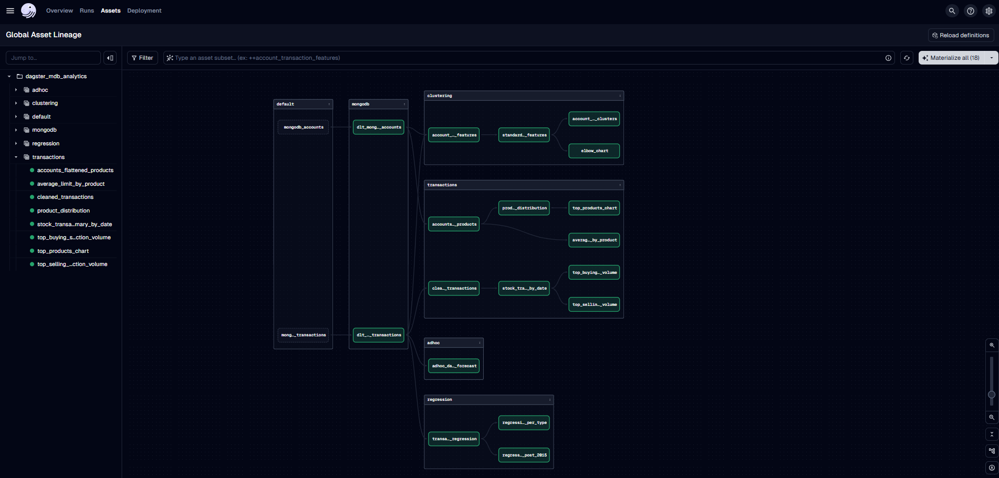

# 📊 Dagster-MongoDB-Snowflake Pipeline

> A modern ETL pipeline combining the power of **Dagster** for orchestration, **DLT** for declarative data loading, and **MongoDB Atlas** as the data source — all seamlessly integrated into **Snowflake** for advanced analytics.  
>  
> Designed to support end-to-end data workflows including **clustering**, **regression modeling**, and automated **scheduling via sensors**, this pipeline is modular, production-ready, and highly extensible for real-world data projects.

<div align="center">
  
</div>

---

## ⚙️ 1. Snowflake Setup

```sql
USE ROLE ACCOUNTADMIN;

CREATE WAREHOUSE dbt_wh WITH WAREHOUSE_SIZE = 'X-SMALL';
CREATE DATABASE dbt_db;
CREATE ROLE dbt_role;

GRANT USAGE ON WAREHOUSE dbt_wh TO ROLE dbt_role;
GRANT ROLE dbt_role TO USER tunguyen150599;
GRANT ALL ON DATABASE dbt_db TO ROLE dbt_role;

USE ROLE dbt_role;
CREATE SCHEMA dbt_db.dbt_schema;
```

**Snowflake Tables Structure**  


---

## 🍃 2. MongoDB Setup

Use MongoDB Atlas and load the `sample_analytics` dataset.

🔗 https://www.mongodb.com/docs/atlas/sample-data/sample-analytics/

**MongoDB Collections Overview**  


---

## 🏗️ 3. Setup Dagster + DLT

### a. Environment Setup

```bash
pip install --upgrade pip
pip install dagster dagster-embedded-elt dagster-webserver bson pymongo
```

or even can run:

```bash
pip install -r requirements.txt
```

### b. Scaffold Dagster Project

```bash
dagster project scaffold --name dagster-mdb-analytics
cd dagster-mdb-analytics
```

### c. Install Required Packages

Add to `setup.py`:

```text
"dagster==1.7.7",
"dagster-cloud==1.7.7",
"dagster-snowflake==0.23.7",
"pymongo>=4.3.3",
"dlt[snowflake]>=0.3.5",
"scikit-learn==1.5.0"
```

Install:

```bash
pip install -e ".[dev]"
```

### d. Init DLT

```bash
mkdir dlt && cd dlt
pip install "dlt[snowflake]"
dlt init mongodb snowflake
pip install -r requirements.txt
cd ../
mv dlt/mongodb dagster_mdb_analytics
```

### e. Setup Environment Variables

```bash
cp .sample-env .env
```

**Do not commit `.env` to version control.**

---

## 🧰 4. Project Folder Usage

```bash
for folder in resources assets sensors partitions jobs schedules; do
  mkdir -p dagster_mdb_analytics/$folder
  touch dagster_mdb_analytics/$folder/__init__.py
done
```

- `assets/`: Data logic with dependencies
- `jobs/`: Graph of assets for orchestration
- `resources/`: External config (Snowflake, MongoDB)
- `partitions/`: Define time-based runs
- `schedules/`: Schedule DAGs periodically
- `sensors/`: React to new files in `datalake_example/`

**Dagster Resources**  


**Dagster Assets**  


**Full Pipeline Graph**  


**Zoomed-in Graph Detail**  


**Job and Schedule View**  


**Sensor Trigger Setup**  


---

## 📦 5. Outputs and Results

Pipeline will run on schedules by definied jobs:

- `data/` – General aggregation and clustering
- `data_clustering_task/` – Clustering output
- `data_regression_task/` – Regression prediction

Pipeline will react to new files in `datalake_example/`. It will process and store results in:

- `data_adhoc/` – Regression prediction

---

## 📚 Documentation

- 🔗 [Dagster Documentation](https://docs.dagster.io/)  
  Learn how to build data assets, define jobs, schedules, sensors, and manage orchestration pipelines with Dagster.

- 🔗 [DLT Documentation](https://dlthub.com/docs/dlt-ecosystem/verified-sources/mongodb)  
  Explore how to declaratively extract, load, and transform data using the DLT Python library.

- 🔗 [MongoDB Sample Dataset – sample_analytics](https://www.mongodb.com/docs/atlas/sample-data/sample-analytics/)  
  Reference for using sample datasets from MongoDB Atlas, ideal for demo and ETL experimentation.
